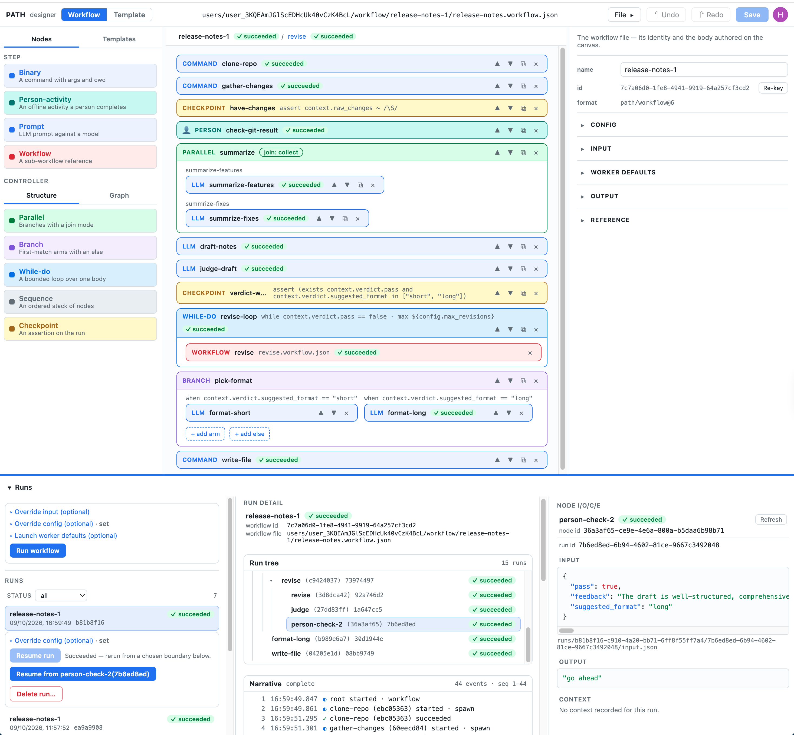

# PATH

[](https://github.com/howardyang2009/PATH/actions/workflows/ci.yml)
[](https://github.com/howardyang2009/PATH/releases)

PATH runs workflows that can stop and start again. A workflow is a JSON file (`path/workflow@6`):
**steps** do the work, **controllers** route it, and **workers** decide how each step runs. A stopped
run resumes as a successor without repeating what already succeeded, and a `person-activity` step
waits for a person to press **Complete**.



## Quick start

Needs Node 24+ and pnpm 12 (`corepack enable`).

```bash
pnpm install
pnpm test
pnpm path run <file>.workflow.json   # run a workflow from the CLI
pnpm serve                           # build both consoles, serve on http://localhost:8080
```

`pnpm serve` serves a landing page at `/`, the **Viewer** (launch, watch, resume and complete runs) at `/viewer/`, and the
**Designer** (author workflows on a canvas) at `/designer/`. Your workflows live in
`users/local/workflow/` and `shared/workflow/`; shipped workflows can be copied into yours. Run data
lives in `.path/`.

PATH also runs in a hosted mode: Clerk sign-in, per-user stores and secrets, and one sandbox VM per
run. See [`docs/spec/path-website.md`](docs/spec/path-website.md).

## Layout

```
packages/schema       workflow format and its zod schemas
packages/engine       the runner and the `path` CLI; step types are plugins
packages/server       HTTP + SSE API and `path-server`
packages/client-core  API client shared by both consoles
packages/viewer       React run console
packages/designer     React authoring console
```

## Docs

- [`CONTEXT.md`](CONTEXT.md): the glossary. Read it first.
- [`docs/format/workflow-format.md`](docs/format/workflow-format.md): the workflow file format.
- [`docs/api/server-api-v0.md`](docs/api/server-api-v0.md): every HTTP route.
- [`docs/adr/`](docs/adr/README.md): architecture decisions.

## Status

Latest release **v0.7.0** (2026-10-09). Release notes live on the
[releases page](https://github.com/howardyang2009/PATH/releases); older history is in
[`CHANGELOG.md`](CHANGELOG.md). MIT licensed.
